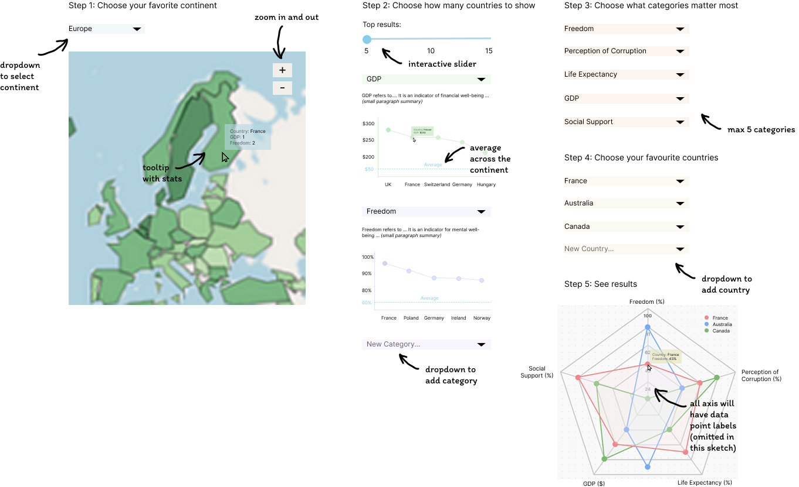
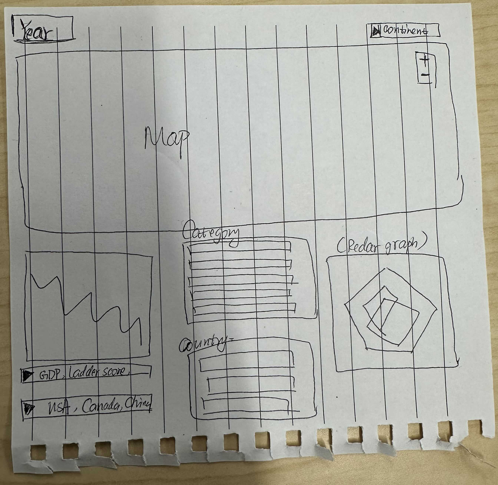

# Milestone 2 Reflection
This section should not be more than 500 words 

## What's Different From The Proposal
For anything that you have done differently than in your proposal/sketch explain why (e.g. implementation difficulty, explanation for why the new approach is more effective, etc).
Include what you are aware of is not working in your dashboard, so that your TAs can distinguish between features in development and bugs.
Explain if you have intentionally deviated from any of the best practices that we learned in 531 regarding effective visualizations.

### Dashboard Design

which parts of your proposal/sketch you have implemented in your dashboard so far and explain what is not yet implemented.

### Data Aggregation and Feature Engineering
We will also derive `Happiness Rank Change`, which will be a numerical column capturing the difference in a countries ranking between years. Additionally, we will create a numerical feature called `regional average`, which aggregates happiness scores across continents for regional comparison.These engineered features will enable users to explore and understand global well-being on a deeper level.

The datasets will be loaded from the World Happiness Report website. Additionally, we will combine these datasets and ensure every country is assigned to a region.

## Impact, Limitations & Opportunities
Reflect on what you think your dashboard does well currently what its limitations are, and what are good potential future improvements and additions.
and be written to the file reports/m2-reflection.md in your GitHub repo.